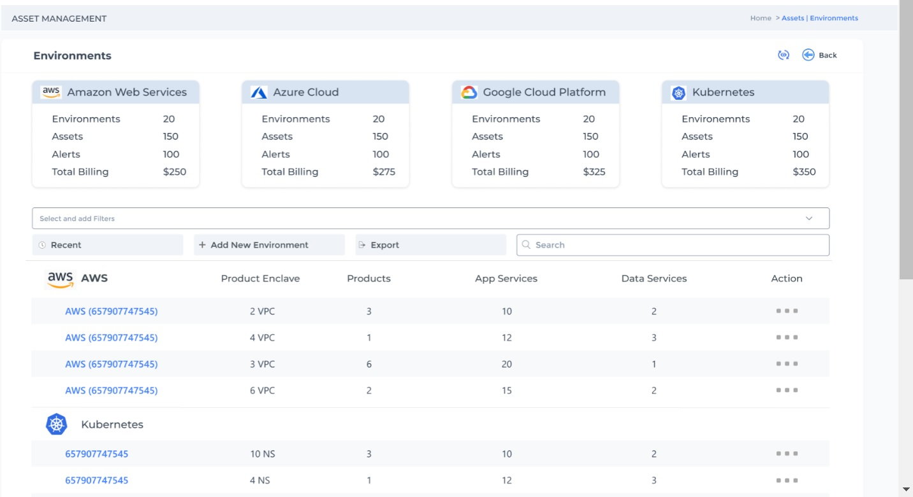
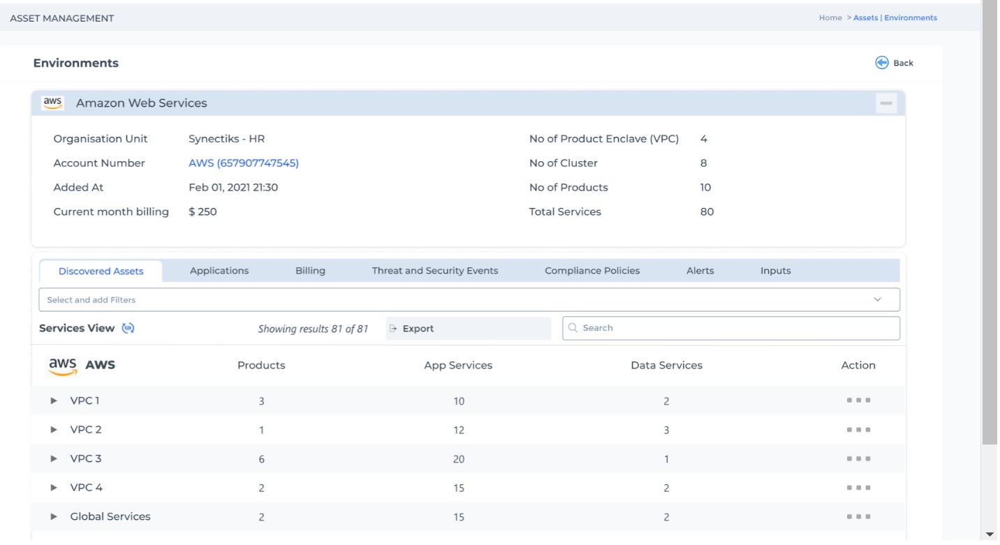
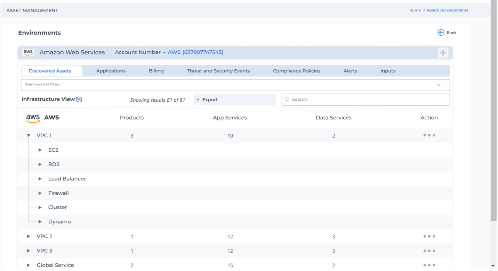
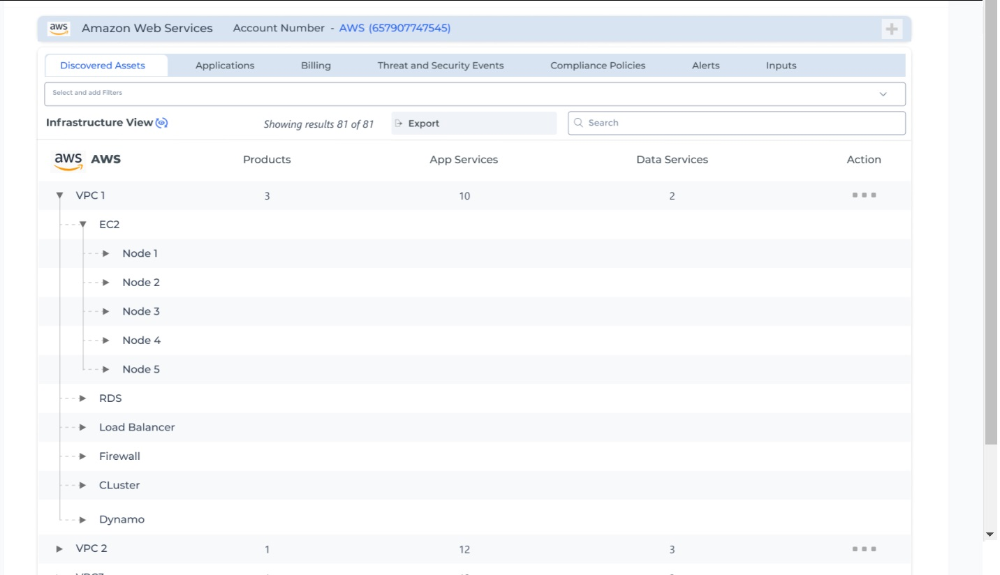

- [Introduction](#introduction)

# Introduction
This document will detail about the aproach we take in phase1 to implement the basic SRE functionalities.
In Phase1 , we wanted to leverage the existing grafana functionalities and write the custom grafana functionalities to implement our features. In phase2 , we will gradually refactor the codebase and will write more independent modules.

please refer to the diagrams below for phase1 and phase2 architecture:
### phase1- architecture

### phase2- architecture

# Phase1 Aproach
Terminology --
**SUI** - Our Stand Alone react based UI
**AWS Cloud Explorer** -- This service will take every AWS account ID as context and will show all the cloud 
elements (WAF / APIGw / CDN / S3 / Route53 / VPC -> EKS/ ECS / EC2 / RDS / Dynamo /.. ) for the account and their element details.

Please refer the design details of AWS explorer as below:

[AWSExplorer](https://www.figma.com/proto/tmzdMgCegtVSQLVgHR6uc3/Netlifi-Usecase-file?page-id=0%3A1&node-id=37%3A16358&viewport=184%2C-681%2C0.04&scaling=scale-down&starting-point-node-id=37%3A16358&show-proto-sidebar=1)  - Shows Cloud ELement Details 

**AWS-API-Server** -- For collecting all the elements data , AWS Cloud Explorer will call the api server.

**Appkube-Catalogue** --  This service will have all the published dashboards / tools etc 
**Appkube-cmdb** -- This service  will have the App / Data services details along with their topology details

# Process Flow

SUI will call the cmdb api's to show every cloud accounts details. The information will be shown as below:
CMDB will have API for all the Data.

When a user clicks on any AWS account id , SUI will open up a HTML iframe page 
<iframe>
Link --awsexplorer.synectiks.net?contextId=accId
<iframe/>

Inside the iframe the  following screens will open

The above screens will come from awsexplorer where SUI will pass the accounID as context like below:

awsexplorer.synectiks.net?contextId=accId inside iframe.

awsexplorer will be a custom grafana application that has a grafana plugin app of Awsexplorer, that will call the cmdb api's to show logical product and services details and aws-api for element details. 

